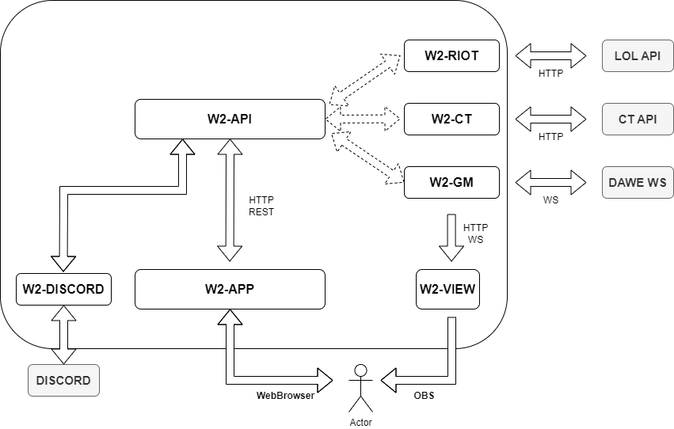

# W2 Project
A este readme le falta mucho por hacer....
## Modules



### API (W2 - API)

The API is the module that handles all CRUD operations to the database. Based on FastAPI framework.

Documentation provided by OpenAPI Docs, on /docs path.

NOTE: Custom python paclage "w2project" is required.

### W2 GM

Designed to connect to DAWE and serve the required WS for the View module. It's also in charge to struct the game picks information and mix it with API available data.

Based on FastAPI framework.

NOTE: Custom python paclage "w2project" is required.

### W2 View

Forked and based from [lol-pick-ban-ui](https://github.com/RCVolus/lol-pick-ban-ui/) european layout from [RCVolus](https://github.com/RCVolus).

Created by a React App and modified from the original version in order to allow additional data, such team logos and render the team logo depending the current active team.

```json
{
   "eventType":"newState",
   "state":{
      "config":{
            "logo": "https://api.leamateur.pro/file/team/uA3r9oN56MvwsmaPouYk.png",
            "scoreEnabled":false,
            "spellsEnabled":true,
            "coachesEnabled":false,
            "blueTeam":{
               "name":"Team Blue",
               "logo": "https://api.leamateur.pro/file/team/zBmEp2rSNU0Ur7vbRyQO.png",
               "score":0,
               "coach":"TEST",
               "color":"rgb(0,151,196)"
            },
            "redTeam":{
               "name":"Team Red",
               "score":0,
               "coach":"TEST",
               "color":"rgb(222,40,70)",
               "logo": "https://api.leamateur.pro/file/team/FBAvKC94jI57OfKQPm4D.png"
            },
            "patch":""
         
      },
      "blueTeam":{
         "picks":[
            {"champion":{"name":"AATROX", "idName":"aatrox", "loadingImg":"https://ddragon.leagueoflegends.com/cdn/img/champion/centered/Aatrox_0.jpg"}, "isActive": false, "displayName":"Pepe"}
         ],
         "bans":[
            
         ],
         "isActive":false
      },
      "redTeam":{
         "picks":[
         ],
         "bans":[
         ],
         "isActive":false
      },
      "timer": 7,
      "champSelectActive":true,
      "leagueConnected": true
   }
}
```

To avoid proxy issues, and since any different test has been done, all URLs should be shared as full absolute URL with public ethernet access.

## Technologies

- PostgreSQL as Database
- [FastAPI](https://fastapi.tiangolo.com/) for REST and WS communications.
